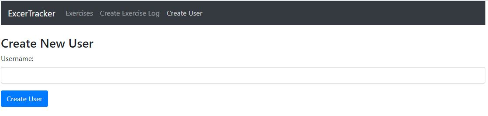

# MERN-STACK-exercise-tracker
MERN STACK  simple exercise tracker

# To initiliaze server 
- Dowload folder and open main directory
- type "cd backend" to terminal or open backend folder
- type "node server.js" to terminal

# To initiliaze client
-open main directory
-type "npm start" to terminal

# Connection to database
In server.js, you should change uri variable any local database string.

## 🧰 Languages and Tools:

 

# Exercise app

